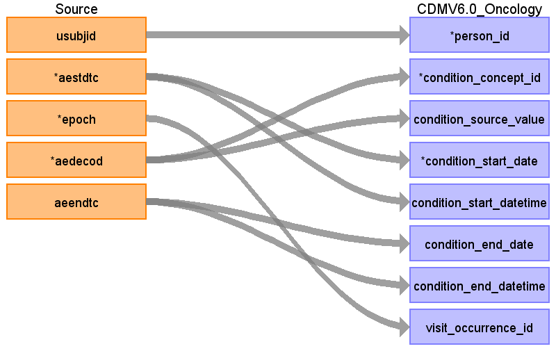

## Table name: condition_occurrence

### Reading from ae.csv

| Destination Field | Source field | Logic | Comment field |
| --- | --- | --- | --- |
| condition_occurrence_id |  |  | Auto-increment |
| person_id | usubjid |  |  |
| condition_concept_id | aedecod | Map to condition_occurrence concepts | How to differentiate between primary condition and adverse events?  |
| condition_source_value | aedecod |  |  |
| condition_start_date | aestdtc |  |  |
| condition_start_datetime | aestdtc | Add timestamp 00:00:00 |  |
| condition_end_date | aeendtc |  |  |
| condition_end_datetime | aeendtc | Add timestamp 00:00:00 |  |
| condition_type_concept_id |  |  | To do |
| stop_reason |  |  |  |
| provider_id |  |  |  |
| visit_occurrence_id | epoch |  | How to get visit_occurrence_id if VISIT field is missing in AE domain?  |
| visit_detail_id |  |  |  |
| condition_source_concept_id |  |  |  |
| condition_status_source_value |  |  |  |
| condition_status_concept_id |  |  |  |

