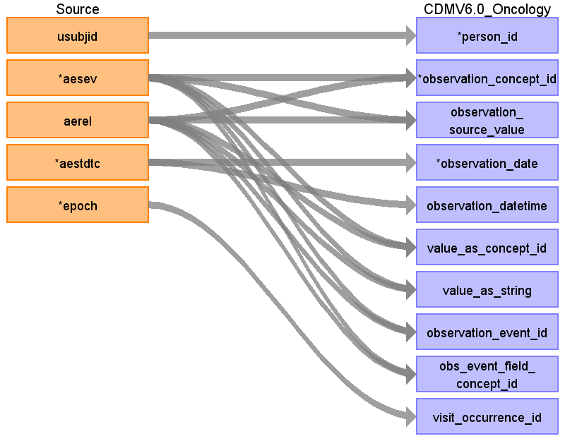

## Table name: observation

### Reading from ae.csv

| Destination Field | Source field | Logic | Comment field |
| --- | --- | --- | --- |
| observation_id |  |  | Auto-increment |
| person_id | usubjid |  |  |
| observation_concept_id | aesev aerel | Severity - 4077563 Relationship to study drug - 45912709 (non-standard, CIEL) |  |
| observation_source_value | aesev aerel |  |  |
| observation_date | aestdtc |  |  |
| observation_datetime | aestdtc | Add timestamp 00:00:00 |  |
| value_as_concept_id | aesev aerel | Mild - 4116992  Moderate - 4285732  Severe - 4087703 Possible - 4162850  Probable - 764222  Remote - 4209878    Do not map when causality is "None"?  Or map None - 4124462 (Meas value qualifier value) | Or map as qualifier_concept_id as all these concepts are of the "Qualifier value" class? Or map as qualifier_concept_id as all these concepts are of the "Qualifier value" class?  |
| value_as_string | aesev aerel |  | Or map as qualifier_source_value as all these concepts are of the "Qualifier value" class? Or map as qualifier_source_value as all these concepts are of the "Qualifier value" class?  |
| observation_event_id | aesev aerel | condition_occurence_id of AE in CONDITION_OCCURRENCE table condition_occurence_id of AE in CONDITION_OCCURRENCE table |  |
| obs_event_field_concept_id | aesev aerel |  | Condition_Occurrence.condition_occurrence_id - 1147663 Condition_Occurrence.condition_occurrence_id - 1147663  |
| visit_occurrence_id | epoch |  | How to get visit_occurrence_id if VISIT field is missing in AE domain?  |
| observation_type_concept_id |  |  | To do |
| value_as_number |  |  |  |
| qualifier_concept_id |  |  |  |
| unit_concept_id |  |  |  |
| provider_id |  |  |  |
| visit_detail_id |  |  |  |
| observation_source_concept_id |  |  |  |
| unit_source_value |  |  |  |
| qualifier_source_value |  |  |  |
| value_as_datetime |  |  |  |

